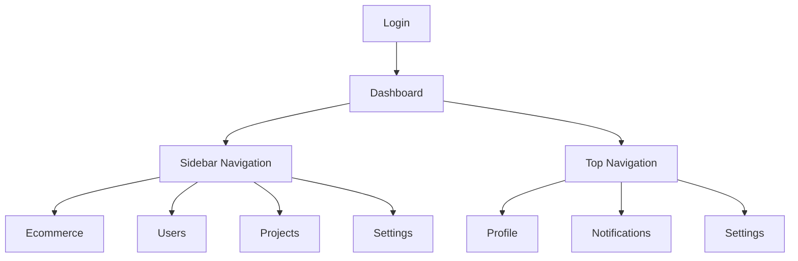

## 1. Product Overview
A responsive admin dashboard with a dark collapsible sidebar and light-themed top navigation. The dashboard provides a professional interface for managing business operations with clean typography, consistent spacing, and intuitive navigation patterns.

Target users: Business administrators, managers, and team leads who need to monitor metrics, manage users, and access various business applications through a unified interface.

## 2. Core Features

### 2.1 User Roles
| Role | Registration Method | Core Permissions |
|------|---------------------|------------------|
| Admin | Email registration with admin privileges | Full access to all dashboard features, user management, and system settings |
| Manager | Admin invitation or email registration | Access to assigned modules, view reports, manage team data |
| User | Email registration | Limited access to specific modules based on role assignment |

### 2.2 Feature Module
The admin dashboard consists of the following main pages:
1. **Dashboard**: Main overview with metrics, charts, and quick stats
2. **Sidebar Navigation**: Collapsible dark sidebar with categorized menu items
3. **Top Navigation**: Light-themed header with user profile, notifications, and quick actions
4. **User Management**: User list, roles, and permissions management
5. **Settings**: Profile settings, preferences, and system configuration

### 2.3 Page Details
| Page Name | Module Name | Feature description |
|-----------|-------------|---------------------|
| Dashboard | Metrics Cards | Display revenue, growth, orders with percentage changes and trend indicators |
| Dashboard | Analytics Charts | Show store performance and weekly insights with interactive charts |
| Dashboard | Sales Report | Present sales data with time-based filters (Today/Monthly/Annual) |
| Sidebar | Brand Area | Show logo and "Paces" brand name with consistent dark theme |
| Sidebar | Menu Sections | Organize menu items into MAIN, APPS, and CUSTOM PAGES categories |
| Sidebar | Navigation Items | Provide access to Dashboards, Ecommerce, Chat, Projects, Tasks, Invoice, CRM, Users, Finance, HRM, Email, Support Center, and Promo |
| Top Navigation | Left Menu | Display Mega Menu and Apps dropdown for quick navigation |
| Top Navigation | Right Actions | Show notifications badge, fullscreen toggle, settings, language selector, and user profile |
| Top Navigation | Breadcrumb | Display current page hierarchy with clear navigation path |
| User Profile | Profile Card | Show user avatar, name, role, and quick actions |
| Settings | Preferences | Allow users to customize dashboard appearance and behavior |

## 3. Core Process
Users access the dashboard through authentication, landing on the main dashboard view. The sidebar provides primary navigation with collapsible functionality for space optimization. The top navigation offers quick access to notifications, settings, and user profile. Users can navigate between different modules using the sidebar menu, with active states clearly indicated. The dashboard displays key metrics and analytics, allowing users to monitor business performance at a glance.

## 4. User Interface Design

### 4.1 Design Style
- **Primary Colors**: Dark sidebar (#0E1424-#111827), light content background (#F5F7FB-#F7F9FC)
- **Secondary Colors**: White cards (#FFFFFF) with subtle borders (#E6EAF1), green (#16A34A-#22C55E) for positive indicators, red (#DC2626-#EF4444) for negative indicators
- **Button Style**: Rounded corners with subtle shadows, primary actions in blue (#3B82F6)
- **Typography**: Modern sans-serif, font weights 500-700 for headings, 400-500 for body text, sizes 12-20px
- **Layout Style**: Card-based layout with consistent 16-24px padding, 20-24px grid gaps
- **Icon Style**: Thin line/outline monochrome icons from Lucide React library

### 4.2 Page Design Overview
| Page Name | Module Name | UI Elements |
|-----------|-------------|-------------|
| Dashboard | Metrics Cards | White cards with subtle shadows, 10-12px border radius, green/red trend indicators with arrows |
| Dashboard | Analytics | Light gray background cards with refresh buttons and status badges |
| Dashboard | Sales Report | Full-width white card with tab navigation and metric icons |
| Sidebar | Navigation | Dark background (#111827), white text at 70-80% opacity, hover states with brighter text |
| Top Navigation | Header | Light background, breadcrumb navigation, user profile with avatar and role text |

### 4.3 Responsiveness
Desktop-first design approach with mobile adaptation. Sidebar collapses to icon-only mode on smaller screens. Top navigation adapts with hamburger menu for mobile devices. Cards stack vertically on mobile with appropriate touch targets (minimum 44px). Touch interactions optimized for mobile users with larger tap areas and swipe gestures where applicable.