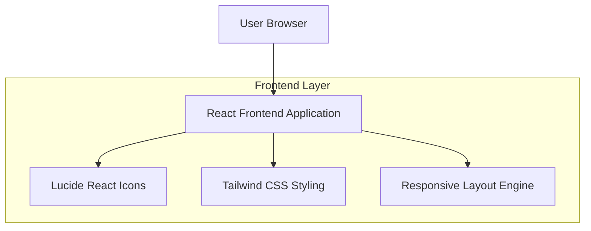
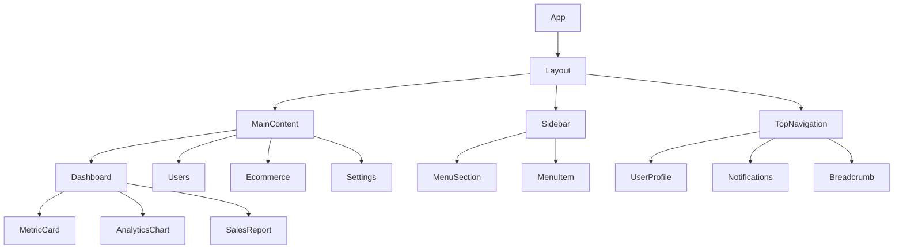

## 1. Architecture design



## 2. Technology Description

- Frontend: React@18 + Tailwind CSS@3 + Vite
- Initialization Tool: vite-init
- Icons: Lucide React
- State Management: React Context API + useState/useEffect
- Routing: React Router DOM
- Backend: None (Frontend-only dashboard)

## 3. Route definitions

| Route | Purpose |
|-------|---------|
| / | Dashboard home page with metrics and analytics |
| /dashboard | Main dashboard with overview cards and charts |
| /users | User management page for viewing and managing users |
| /ecommerce | Ecommerce module with sales and product data |
| /projects | Project management interface |
| /settings | User preferences and system settings |

## 4. Component Architecture

### 4.1 Core Components

**Sidebar Component**
```typescript
interface SidebarProps {
  isCollapsed: boolean;
  activeRoute: string;
  onToggle: () => void;
}

interface MenuItem {
  id: string;
  label: string;
  icon: React.ReactNode;
  route: string;
  badge?: string;
  subItems?: MenuItem[];
}
```

**Top Navigation Component**
```typescript
interface TopNavProps {
  user: User;
  notifications: Notification[];
  onLogout: () => void;
}

interface User {
  name: string;
  role: string;
  avatar: string;
}

interface Notification {
  id: string;
  message: string;
  type: 'info' | 'warning' | 'error';
  timestamp: Date;
}
```

**Dashboard Card Component**
```typescript
interface DashboardCardProps {
  title: string;
  value: string | number;
  change?: {
    percentage: number;
    trend: 'up' | 'down';
  };
  icon?: React.ReactNode;
  color?: 'green' | 'red' | 'blue' | 'gray';
}
```

## 5. Component Hierarchy



## 6. Responsive Design System

### 6.1 Breakpoint System
- Mobile: 320px - 640px
- Tablet: 641px - 1024px  
- Desktop: 1025px - 1280px
- Large Desktop: 1281px+

### 6.2 Layout Adaptations
- **Mobile**: Sidebar hidden, hamburger menu in top nav, single column layout
- **Tablet**: Collapsible sidebar, two-column grid for cards
- **Desktop**: Full sidebar visible, three-column grid for cards
- **Large Desktop**: Enhanced spacing, maximum content width of 1440px

### 6.3 CSS Classes Structure
```css
/* Sidebar responsive classes */
.sidebar-mobile { @apply fixed inset-y-0 left-0 z-50 w-64 transform -translate-x-full; }
.sidebar-tablet { @apply w-16 hover:w-64 transition-all duration-300; }
.sidebar-desktop { @apply w-64; }

/* Content area responsive classes */
.content-mobile { @apply ml-0 px-4 py-6; }
.content-desktop { @apply ml-64 px-6 py-8; }

/* Card grid responsive classes */
.card-grid-mobile { @apply grid-cols-1 gap-4; }
.card-grid-tablet { @apply grid-cols-2 gap-6; }
.card-grid-desktop { @apply grid-cols-3 gap-8; }
```

## 7. State Management Structure

### 7.1 Global Context
```typescript
interface AppContextType {
  sidebarCollapsed: boolean;
  activeRoute: string;
  user: User | null;
  notifications: Notification[];
  toggleSidebar: () => void;
  setActiveRoute: (route: string) => void;
  markNotificationRead: (id: string) => void;
}
```

### 7.2 Local Component State
- Dashboard metrics and data
- Sidebar menu expansion states
- Notification panel visibility
- User profile dropdown state
- Theme preferences

## 8. Performance Optimizations

### 8.1 Code Splitting
- Route-based code splitting with React.lazy()
- Component-level splitting for heavy charts
- Icon lazy loading with Lucide React

### 8.2 Caching Strategy
- Local storage for user preferences
- Session storage for temporary data
- Memoization for expensive calculations
- Debouncing for search and filter operations

### 8.3 Bundle Optimization
- Tree shaking with Vite
- CSS purging with Tailwind
- Icon selective imports
- Image optimization for avatars and logos